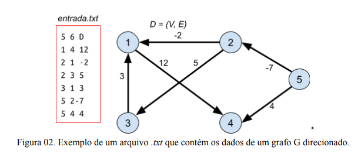

# Matriz de Adjacência ou Incidência

## Objetivo

Implementar uma função, que deve funcionar para qualquer quantidade de vértices e arestas, para carregar o grafo da [figura 01](#Imagens) e/ou [figura 02](#Imagens) de nome entrada.txt utilizando as seguintes estruturas de
dados:

- Matriz de adjacência
- Matriz de incidência

### Imagens

Figura 1 | Figura 2 |
---------|---------|
  | 