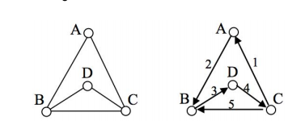

# Resolvedor de Caminho Eureliano

- [Resolvedor de Caminho Eureliano](#resolvedor-de-caminho-eureliano)
  - [Explicação: Caminho Eureliano](#explicação-caminho-eureliano)
  - [Objetivo](#objetivo)
  - [Como usar](#como-usar)
    - [Como alterar a entrada do programa](#como-alterar-a-entrada-do-programa)

## Explicação: Caminho Eureliano

> [“Um Caminho Euleriano é um caminho em um grafo que visita toda aresta exatamente uma vez.... O conceito foi introduzido por Leonard Euler para a resolução do famoso problema das sete pontes de Königsberg em 1736.”](https://pt.wikipedia.org/wiki/Caminho_euleriano)

Como um exemplo, considere as figuras abaixo:

<div style="text-align:center"></div>

Na figura da esquerda temos um grafo com vértices A,B,C,D. Na segunda figura é mostrado um caminho, que começa no vértice C, que passa por cada aresta exatamente uma única vez.

## Objetivo

Dada uma instância de um grafo você deverá criar uma fórmula em lógica proposicional cuja valoração que a satisfaz é um caminho euleriano. Para ter certeza de que o grafo possui de fato um caminho euleriano você poderá “trapacear” no jogo anteriormente mencionado (todas as instâncias possuem caminho euleriano).

Utilizar de um SAT-SOLVER para resolver uma entrada na forma normal conjuntiva.

## Como usar

Será necessário ter o python e pip instalados, e ter a biblioteca [PySAT](https://github.com/pysathq/pysat) instalada para rodar o código.

É possível instalar o PySAT rodando o seguinte comando no terminal:

```bash
pip install python-sat
```

Com o PySAT instalado é necessário executar o comando abaixo na pasta do projeto para que o programa execute e exiba os resultados:

```bash
python code.py
```

### Como alterar a entrada do programa

Será necessário alterar o conteudo do arquivo **entrada.txt**

A seguinte tabela representa o grafico da [figura 1](#fig1) acima como uma entrada para o programa:  
entrada.txt| Representação com letras|
:-------:|:-------:|
1 2| A B
1 3| A C
2 1| B A
2 3| B C
2 4| B D
3 1| C A
3 2| C B
3 4| C D
4 2| D B
4 3| D C

Cada linha no arquivo representa a conexão entre os vértices, é necessário colocar todos os possíveis caminhos no arquivo e em ordem crescente dos possíveis caminhos.
